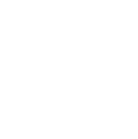

# **Wschodnia Gallery**

This is the website of an art gallery in Lodz, Poland called Wschodnia, which is the name of the street where the gallery is situated. I decided to do a website for this art space because I've been co-running it for over 20 years. My reasoning is partially sentimental and partially practical - I have lots of texts and images about the place at my disposal.

The website is accessible and designed as mobile-first, using UX/UI principles. 

[Click here to view the live website.](https://ewelinachm.github.io/wschodnia-gallery/index.html)

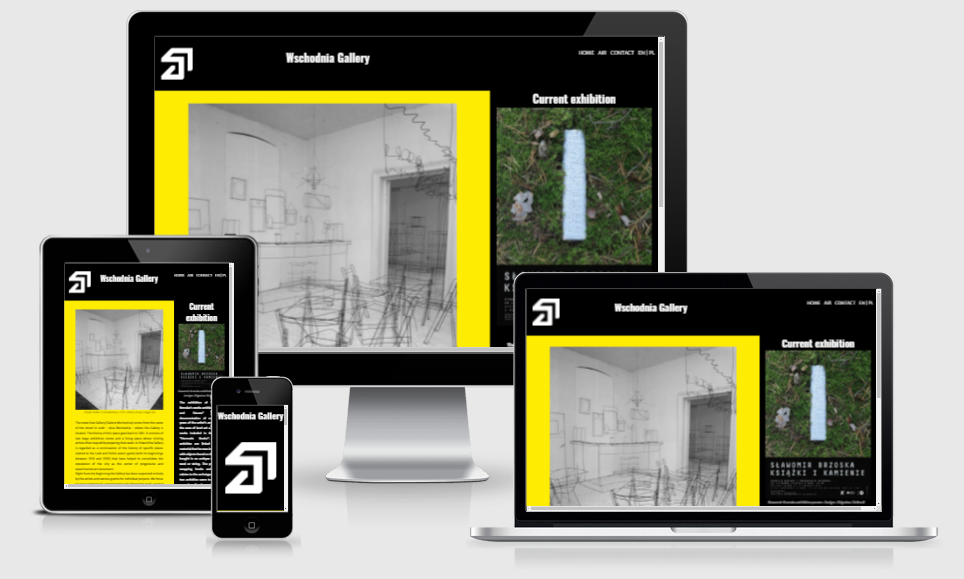

# User Experience #

## User Stories ##

### From general audience perspective: ###
    1. As an audience member I want to have a general info about the gallery.
    2. As an audience member I want to know where the gallery is situated.
    3. As an audience member I want to know what is the current exhibition.
    4. As an audience member I want to know what are the opening hours.
    5. As an audience member I want to know how can I contact the gallery.

### General audience perspective fulfillment: ###
    1. Home page of the website contains the info on the gallery and its short background.
    2. Contact page of the website contains embeded Google maps iframe showing the location of the gallery.
    3. Home page of the website contains an info on the current exhibition next to the gallerie's info.
    4. Beneath the info on the current exhibition there's a clear information about the opening hours.
    5. Contact page contains forms for different types of inquiries. On the home page, section about the current exhibition contains a phone number. On every page there is a footer section with links to the gallerie's social media pages.

### From arists' perspective: ###
    1. As an artist I want to know if the gallery runs a programme I could participate in.
    2. As an artist I want to know how can I contact the gallery if I want to participate in such a programme.

### Artists' perspective fulfillment: ###
    1. There is a page dedicated to the Arist-in-Residence programme dedicated to the artists.
    2. On the contact page there is an application form for the artists interested in the programme.

### From all users perspective: ###
    1. As a user I want to clearly see the content and navigate smoothly through the pages.

### All users perspective fulfillment: ###
    1. Content on all of the pages is divided into sections using 3 colours. There is a navigation bar in the top-right part of all the pages.

## Design ##
There are 3 main, high-contrast colours used throughout the whole website: black, white and yellow which is the same colour scheme used in the design of the book about the gallery.
Oswald font is used for headings because it's very similar to the font used in the official gallery's printed logo: Impact. Merriweather Sans font used for text is a font that is very compatible visually with Oswald.
For designing the main structure of the website I've created wireframes using Balsamiq software.

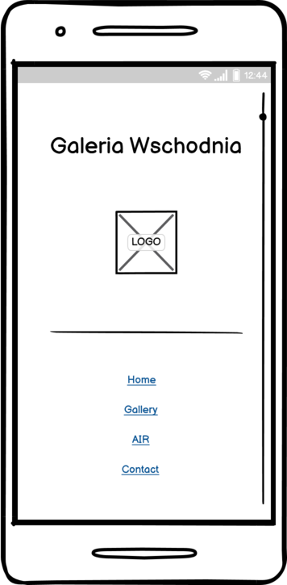 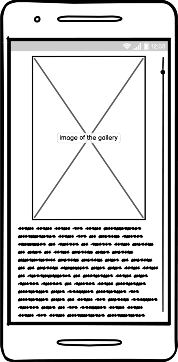 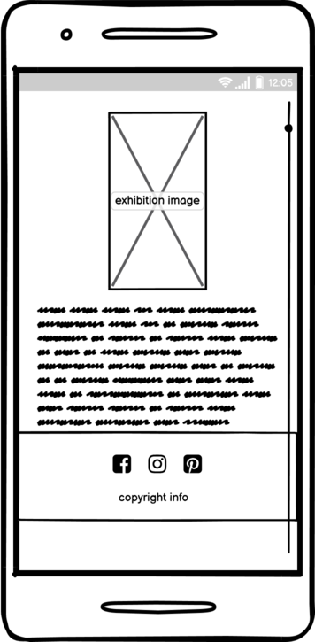 

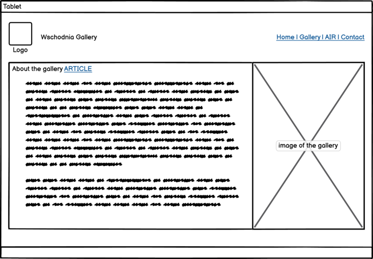 
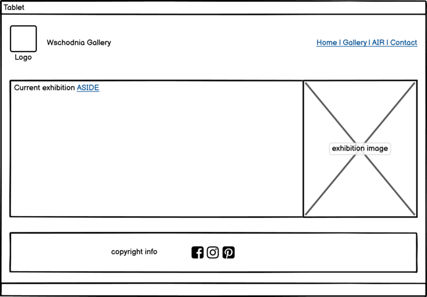

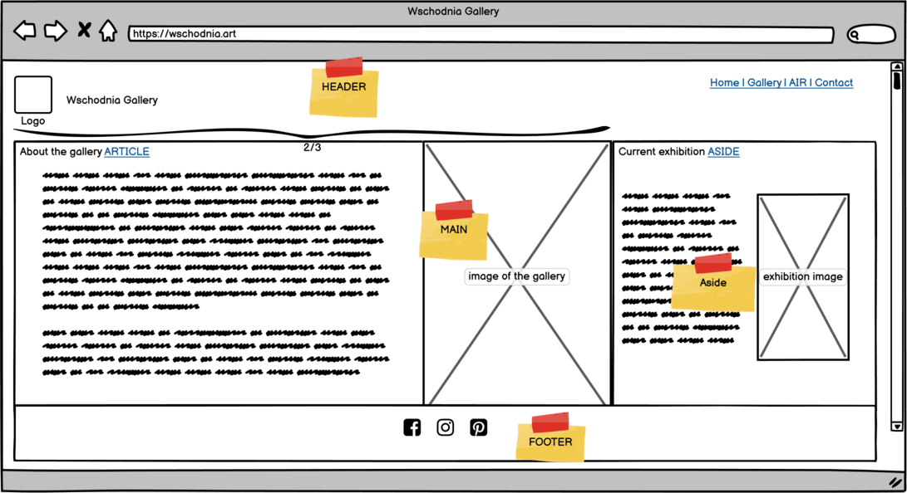

# Features #

## Existing Features ##
1. Navigation bar
Navigation bar containing the gallery's logo, name and links to: home page, Artist-in-Residence programme page, contact page and language change (not implemented in this project) is fully responsive and is identical on all pages for screens larger than 768px. For smaller screens the nav bar appears vertically with larger image and fonts.

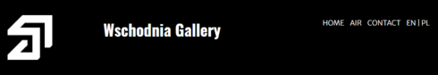 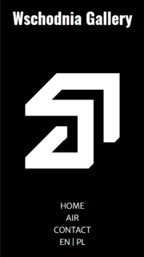

2. Main content
Main content appearing in the middle of all the pages is divided into 2 sections, one (main) spreading onto 2/3 of the page and another one (aside), on the right side on screens larger than 768px. They are visually distinctive having different background colour. Same design is used on all of the pages for clear content display. On screens smaller than 768px the aside element is placed beaneath the 
main section.

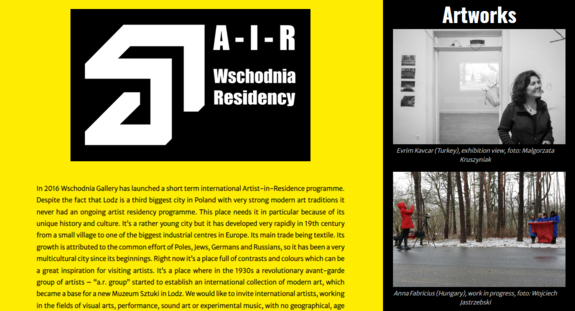

3. Contact page
Contact page consists of forms dedicated to all users and artists specifically. First is a sign-up for the newsletter form, second one is a form for artists interested in participating in the Artists-in-Residence programme and the last one is for all users interested in buying a book about the gallery.

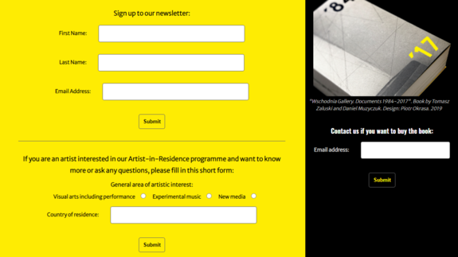

4. Footer
Footer element is identical on all the pages except for contact page. It has links in the form of icons to the gallery's social media pages (currently non-existent). The contact page has also the embeded Google maps iframe showing the gallery's location in the footer.

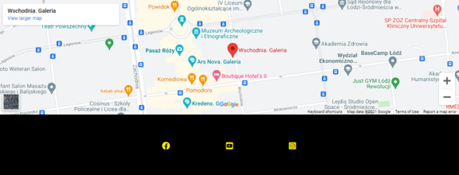

## Features to Implement in the Future ##
Polish version of the website.

# Technologies used #
1. Languages: [HTML5](https://en.wikipedia.org/wiki/HTML5), [CSS3](https://en.wikipedia.org/wiki/Cascading_Style_Sheets)
2. [Google Fonts](https://fonts.google.com/) for fonts used on all pages of the website
3. [Font Awesome](https://fontawesome.com/) for icones used in the footer
4. [Favicon](https://www.favicon.cc/) to create an icon showing in the browser tab
5. [Git](https://git-scm.com/) for version control
6. [GitHub](https://github.com/) to store the project
7. [Gitpod](https://www.gitpod.io/) to develop the project
8. [Balsamiq](https://balsamiq.com/) to create wireframes
9. [ColorSpace](https://mycolor.space/) to test and implement colors
10. [ILoveMG](https://www.iloveimg.com/) to resize and optimize images
11. [RealWorld Paint](http://www.rw-designer.com/image-editor) for creating an SVG file from the gallery's logo

# Resources #
1. [Code Institute](https://codeinstitute.net/) - course materials, footer and forms adapted from the Love Running project
2. [W3Schools](https://www.w3schools.com/) - tutorials
3. [MDN](https://developer.mozilla.org/) - learning materials
4. [YouTube](https://www.youtube.com/) - tutorials
5. [Stackoverflow](https://stackoverflow.com/) - problem solving
6. [Code Institute Slack community](https://slack.com/) - problem solving, testing
7. [Am I Responsive](http://ami.responsivedesign.is/) - mockup for readme file
8. [Duda blog](https://blog.duda.co/) - responsive google map iframe adapted from the blog
9. [Chrome Dev Tools](https://developer.chrome.com/docs/devtools/) - for testing and debugging

# Testing #
[W3C Markup Validator](https://validator.w3.org/) was used to validate all the pages' HTML code. It found 2 errors and 2 warnings:
1. Error showing stray script - the script from font awesome was placed at the bottom of the page, after the body element - corrected.
2. Error showing unclosed element on the contact page - Form element in the aside section wasn't closed - corrected .
3. Warning concerning using h1 element in the aside section instead of smaller headings - corrected.
4. Warning concerning no heading in the article section - left for the design purposes.
Project was also tested manually on the following browsers: Google Chrome, Microsoft Edge, Mozilla Firefox, Opera.
For responsivess testing I used Chrome Developer Tools.

[W3C CSS Validator](https://jigsaw.w3.org/css-validator/) was used to validate the CSS code. No errors were found.

# Deployment #
The site was deployed to GitHub pages. The steps to deploy are as follows:
1. In the GitHub repository, navigate to the Settings tab
2. From the source section drop-down menu, select the Main Branch
3. Once the main branch has been selected, the page will be automatically refreshed with a detailed ribbon display to indicate the successful deployment.
The live link can be found here: [https://ewelinachm.github.io/wschodnia-gallery/contact.html](https://ewelinachm.github.io/wschodnia-gallery/contact.html)

# Credits #
All texts and images were provided by the gallery's owners with the permission to use for this proect purposes. Parts of the code form different sources that I have used for this project can be found listed in the Resources section of this Readme file.